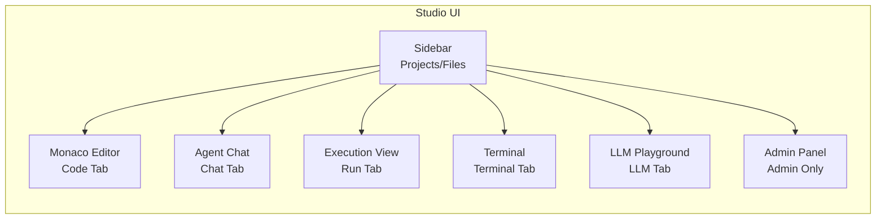
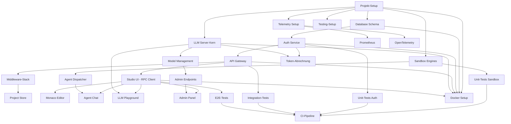

# CyberDevStudio - Vollständiger Entwicklungsplan

## Hintergrund

CyberDevStudio ist ein produktionsreifes, Multi-Agenten DevStudio mit folgenden Kerntechnologien:
- **Backend**: Rust (Execution, Sandbox, Orchestrator)
- **Frontend**: TypeScript, React, Tailwind, Monaco Editor
- **LLM-Inferenz**: node-llama-cpp (max. 3B GGUF-Modelle)
- **Datenbank**: PostgreSQL + PostgresML
- **Observability**: OpenTelemetry, Prometheus, Grafana
- **Containerisierung**: Docker Compose

Das Projekt implementiert 6 Hauptdomänen ohne Mock-Funktionalitäten, vollständig getestet und release-fähig.

## Projektziele

1. **Vollständige Modularität**: Klare Trennung in Apps, Sandbox, Schemas, Database, Tests
2. **Produktionsreife**: Kein Platzhalter-Code, alle Features vollständig implementiert
3. **Sicherheit**: JWT-Auth, API-Key-Verwaltung, Token-Abrechnung, Rate-Limiting
4. **Observability**: Vollständige Telemetrie, Metrics, Logging
5. **Test-Coverage**: Mindestens 85% Coverage mit Unit-, Integration- und E2E-Tests
6. **Deployment-Ready**: Docker Compose mit allen Services auf nicht-standardisierten Ports

## Architektur-Übersicht

```mermaid
graph TB
    subgraph "Frontend Layer"
        UI[Studio UI<br/>React+Monaco+Tailwind<br/>Port 6711]
    end
    
    subgraph "API Gateway Layer"
        API[API Gateway<br/>JSON-RPC<br/>Port 6813]
        AUTH[Auth Service<br/>JWT+API Keys<br/>Port 6971]
    end
    
    subgraph "Execution Layer"
        ORCHESTRATOR[Agent Orchestrator<br/>agent_dispatcher.rs]
        SANDBOX[Sandbox Engines<br/>fs|run|wasm|micro]
    end
    
    subgraph "LLM Layer"
        LLM[LLM Server<br/>node-llama-cpp<br/>Port 6988]
        ADMIN[Admin Panel<br/>Model Management]
    end
    
    subgraph "Data Layer"
        DB[(PostgreSQL+PostgresML<br/>Port 6472)]
    end
    
    subgraph "Observability Layer"
        OTEL[OpenTelemetry]
        PROM[Prometheus]
        GRAF[Grafana]
    end
    
    UI --> API
    UI --> AUTH
    API --> ORCHESTRATOR
    API --> LLM
    ORCHESTRATOR --> SANDBOX
    AUTH --> DB
    API --> DB
    LLM --> DB
    SANDBOX --> OTEL
    API --> OTEL
    LLM --> OTEL
    OTEL --> PROM
    PROM --> GRAF
```

## Domäne 1: Projekt-Setup & Grundstruktur

### Verzeichnisstruktur anlegen

Erstelle die vollständige Projektstruktur gemäß Spezifikation:

```
CyberDevStudio/
├── apps/
│   ├── studio-ui/
│   ├── api/
│   ├── llmserver/
│   └── auth/
├── schemas/rpc/
├── database/migrations/
├── docker/
├── sandbox/
├── tests/
├── examples/rpc/
├── metrics/
├── themes/
└── docs/
```

### Dependency-Management

**Rust (Workspace-Level)**
- `Cargo.toml` Workspace mit Members: `api`, `sandbox`, `auth`
- Dependencies:
  - `tokio` (async runtime)
  - `axum` (Web Framework)
  - `serde`, `serde_json` (Serialisierung)
  - `sqlx` (PostgreSQL Client)
  - `jsonwebtoken` (JWT)
  - `wasmer` (WASM Engine)
  - `tracing`, `tracing-subscriber` (Logging)
  - `opentelemetry`, `opentelemetry-otlp` (Telemetry)

**Node.js (llmserver)**
- `package.json` mit:
  - `node-llama-cpp` (LLM Inferenz)
  - `express` (REST API)
  - `ws` (WebSocket)
  - `@huggingface/hub` (Model Download)
  - `prom-client` (Prometheus Metrics)

**React (studio-ui)**
- `package.json` mit:
  - `react`, `react-dom`
  - `@monaco-editor/react`
  - `tailwindcss`
  - `socket.io-client` (WebSocket)
  - `vite` (Build Tool)

### Konfigurationsdateien

- `docker-compose.yml` mit allen Services (api:6813, llmserver:6988, ui:6711, auth:6971, db:6472)
- `.env.example` für Environment Variables
- `tsconfig.json` für TypeScript-Projekte
- `tailwind.config.js` mit Custom Themes
- `rust-toolchain.toml` für Rust-Version

## Domäne 2: Orchestrator & Agents

### Agent Dispatcher (Rust)

**Datei**: `sandbox/agent_dispatcher.rs`

Implementiere Task-Router mit folgenden Agent-Typen:
- `CodeAgent`: Code-Generierung, Refactoring
- `TestAgent`: Test-Generierung, Test-Ausführung
- `DesignAgent`: UI/UX-Vorschläge
- `DebugAgent`: Fehleranalyse, Debugging
- `SecurityAgent`: Security-Audit, Vulnerability-Check
- `DocAgent`: Dokumentations-Generierung

Jeder Agent:
- Eigene Trait-Implementierung
- Context-Management (Session, History)
- LLM-Integration via JSON-RPC
- Ergebnis-Validierung

### Agent-Koordination

**Datei**: `sandbox/orchestrator.rs`

- Task-Queuing mit Prioritäten
- Parallele Agent-Ausführung
- Konfliktauflösung bei gleichzeitigen Änderungen
- Status-Tracking (pending, running, completed, failed)
- Rollback-Mechanismus bei Fehlern

### JSON-RPC Schema

**Datei**: `schemas/rpc/agent.json`

Definiere RPC-Calls:
- `agent.dispatch` - Agent-Task starten
- `agent.status` - Status abfragen
- `agent.cancel` - Task abbrechen
- `agent.list` - Verfügbare Agents
- `agent.history` - Ausführungshistorie

## Domäne 3: Sandbox Layer

### Filesystem Engine

**Datei**: `sandbox/fs.rs`

Implementiere:
- `fs.read(path)` - Datei lesen
- `fs.write(path, content)` - Datei schreiben
- `fs.list(path)` - Verzeichnis auflisten
- `fs.delete(path)` - Datei/Ordner löschen
- `fs.move(src, dest)` - Verschieben
- `fs.copy(src, dest)` - Kopieren
- `fs.mkdir(path)` - Verzeichnis erstellen

Sicherheit:
- Chroot-ähnliche Isolation
- Pfad-Validierung (keine `..` Escapes)
- Größenlimits pro Datei
- Quota pro User

### Runtime Execution Engine

**Datei**: `sandbox/run.rs`

Implementiere:
- `run.exec(command, args, env)` - Kommando ausführen
- `run.stream(command)` - Stream-Output
- `run.kill(process_id)` - Prozess beenden

Technische Umsetzung:
- `std::process::Command` mit Timeouts
- Resource Limits (CPU, Memory)
- Environment-Isolation
- STDOUT/STDERR Capturing
- Exit-Code Handling

### WebAssembly Engine

**Datei**: `sandbox/wasm.rs`

Basierend auf `wasmer`:
- `wasm.load(bytes)` - WASM-Modul laden
- `wasm.call(function, args)` - Funktion aufrufen
- `wasm.memory_limit(bytes)` - Memory-Limit setzen

Features:
- WASI-Support
- Memory-Isolation
- Fuel-Metering (CPU-Limits)
- Host-Function-Imports (File I/O)

### MicroVM Engine

**Datei**: `sandbox/micro.rs`

Integration von `microsandbox`:
- `micro.start(image, script)` - VM starten (Node.js/Python)
- `micro.execute(vm_id, code)` - Code ausführen
- `micro.stop(vm_id)` - VM beenden

Implementierung:
- VM-Pool für Wiederverwendung
- Network-Isolation
- Shared-Nothing-Architektur
- Snapshot/Restore-Support

### RPC Schema für Sandbox

**Datei**: `schemas/rpc/sandbox.json`

- `fs.*` - Alle Filesystem-Operationen
- `run.*` - Runtime-Execution
- `wasm.*` - WebAssembly-Calls
- `micro.*` - MicroVM-Operationen

## Domäne 4: LLM Server (node-llama-cpp)

### LLM Server Kern

**Datei**: `apps/llmserver/src/server.ts`

Implementiere Express-Server mit:
- `POST /v1/chat/completions` - OpenAI-kompatible Chat-API
- `POST /v1/completions` - Klassische Completion
- `POST /v1/embeddings` - Embedding-Generierung
- `WebSocket /v1/stream` - Streaming-Completion

### Model Management

**Datei**: `apps/llmserver/src/models.ts`

Funktionen:
- `downloadModel(huggingface_url)` - Download von HuggingFace
- `loadModel(model_id, config)` - Modell laden mit Config (threads, context_size, temperature)
- `unloadModel(model_id)` - Modell entladen
- `listModels()` - Verfügbare + geladene Modelle

Unterstützte Modelle (≤ 3B):
- `deepseek-coder-1.3b` (Coding)
- `nous-hermes-2-3b.Q4` (Chat)
- `bge-small-en-v1.5` (Embeddings)
- `tinyllama-1.1b-func` (Function Calling)

### Token-Tracking

**Datei**: `apps/llmserver/src/tokens.ts`

- Token-Counting via `node-llama-cpp` Tokenizer
- Middleware für alle `/v1/*` Endpoints
- PostgreSQL-Logging: `(user_id, model_id, tokens, timestamp)`
- Rate-Limiting pro User/API-Key

### Admin-Endpoints

**Datei**: `apps/llmserver/src/admin.ts`

Nur für `admin`-Rolle via JWT:
- `POST /admin/load` - Modell laden
- `POST /admin/unload` - Modell entladen
- `POST /admin/download` - Modell von HuggingFace laden
- `GET /admin/status` - RAM, aktive Sessions, Thread-Count
- `GET /admin/models` - Modellübersicht

### Prometheus Metrics

**Datei**: `apps/llmserver/src/metrics.ts`

Exportiere Metriken:
- `llm_requests_total` (Counter)
- `llm_tokens_generated` (Counter)
- `llm_inference_duration_seconds` (Histogram)
- `llm_model_memory_bytes` (Gauge)
- `llm_active_sessions` (Gauge)

Endpoint: `GET /metrics`

## Domäne 5: Token- und Nutzersystem

### Database Schema

**Datei**: `database/migrations/001_init.sql`

Tabellen:

```sql
CREATE TABLE users (
    id SERIAL PRIMARY KEY,
    username VARCHAR(255) UNIQUE NOT NULL,
    password_hash VARCHAR(255) NOT NULL,
    role VARCHAR(50) NOT NULL, -- 'admin' | 'developer' | 'viewer'
    api_key_hash VARCHAR(255) UNIQUE,
    token_balance INTEGER DEFAULT 0,
    created_at TIMESTAMP DEFAULT NOW()
);

CREATE TABLE models (
    id SERIAL PRIMARY KEY,
    name VARCHAR(255) UNIQUE NOT NULL,
    huggingface_url TEXT,
    context_size INTEGER,
    cost_per_token DECIMAL(10, 6),
    is_loaded BOOLEAN DEFAULT FALSE,
    loaded_at TIMESTAMP
);

CREATE TABLE tokens_used (
    id SERIAL PRIMARY KEY,
    user_id INTEGER REFERENCES users(id),
    model_id INTEGER REFERENCES models(id),
    tokens INTEGER NOT NULL,
    endpoint VARCHAR(100),
    timestamp TIMESTAMP DEFAULT NOW()
);

CREATE INDEX idx_tokens_user ON tokens_used(user_id);
CREATE INDEX idx_tokens_model ON tokens_used(model_id);
CREATE INDEX idx_tokens_timestamp ON tokens_used(timestamp);
```

### PostgresML Integration

**Datei**: `database/migrations/002_pgml.sql`

- PostgresML Extension aktivieren
- Embedding-Tabelle für Code-Suche
- Vector-Index für Similarity-Search
- Model-Training für User-Behavior-Prediction

### Auth Service

**Datei**: `apps/auth/src/main.rs`

Implementiere Axum-Server:
- `POST /auth/register` - User registrieren
- `POST /auth/login` - Login mit JWT
- `POST /auth/refresh` - Token erneuern
- `POST /auth/api-key/generate` - API-Key generieren
- `DELETE /auth/api-key/revoke` - API-Key widerrufen

JWT-Claims:
```rust
struct Claims {
    sub: i32,        // user_id
    username: String,
    role: String,
    exp: usize,      // Expiry
}
```

### Token-Abrechnung Middleware

**Datei**: `apps/api/src/middleware/tokens.rs`

Für jeden LLM-Request:
1. User aus JWT/API-Key extrahieren
2. Balance prüfen
3. Request durchführen
4. Tokens zählen
5. In DB schreiben: `INSERT INTO tokens_used`
6. Balance aktualisieren

### User-Management

**Datei**: `apps/auth/src/users.rs`

Admin-Endpoints (nur für `admin`-Rolle):
- `POST /admin/users` - User erstellen
- `PUT /admin/users/:id/balance` - Token-Balance setzen
- `PUT /admin/users/:id/role` - Rolle ändern
- `DELETE /admin/users/:id` - User löschen
- `GET /admin/users/:id/usage` - Token-Verbrauch anzeigen

## Domäne 6: Studio UI

### UI-Architektur



### Monaco Editor Integration

**Datei**: `apps/studio-ui/src/components/Editor.tsx`

Features:
- Multi-File-Tabs
- Syntax-Highlighting für alle Sprachen
- Auto-Completion via Language Server Protocol (LSP)
- Diff-View für Agent-Änderungen
- Inline-Diagnostics (Errors, Warnings)
- Git-Integration (Diff-Marker)

### Agent Chat

**Datei**: `apps/studio-ui/src/components/AgentChat.tsx`

Implementierung:
- WebSocket-Verbindung zu API-Server
- Chat-History mit Markdown-Rendering
- Code-Block-Highlighting
- Agent-Auswahl (Dropdown)
- Streaming-Antworten
- Context-Injection (aktuelle Datei, Selection)

### Execution View

**Datei**: `apps/studio-ui/src/components/ExecutionView.tsx`

Features:
- Run-Button mit Engine-Auswahl (fs, run, wasm, micro)
- STDOUT/STDERR Live-Stream
- Exit-Code Anzeige
- Kill-Button für laufende Prozesse
- Output-Download

### Terminal

**Datei**: `apps/studio-ui/src/components/Terminal.tsx`

Integration via `xterm.js`:
- WebSocket-Terminal zu `run`-Engine
- Command-History
- Copy/Paste-Support
- Theming (NeonCyberNight, SerialSteel)

### LLM Playground

**Datei**: `apps/studio-ui/src/components/LLMPlayground.tsx`

Features:
- Model-Auswahl (Dropdown)
- System-Prompt + User-Prompt
- Temperature, TopK, TopP Slider
- Max-Tokens Setting
- Streaming-Output
- Token-Counter (Live)
- Cost-Anzeige

### Admin Panel

**Datei**: `apps/studio-ui/src/components/AdminPanel.tsx`

Nur für `admin`-Rolle:

**Model Management**
- Tabelle: Verfügbare Modelle
- Aktionen: Download, Load, Unload
- Status: Loaded/Unloaded, RAM-Usage
- Config: Threads, Context-Size

**User Management**
- Tabelle: Alle User
- Aktionen: Create, Edit Role, Set Balance, Delete
- Token-Usage-Statistik pro User

**System Status**
- CPU/RAM-Auslastung
- Active Sessions
- Request-Rate (Requests/sec)
- Error-Rate

**Logs & Metrics**
- Request-Log-Tabelle (letzte 100)
- Token-Verbrauch-Chart
- Grafana-Embed

### Theme System

**Datei**: `apps/studio-ui/src/themes/`

**NeonCyberNight**
- Dunkles Theme mit Neon-Akzenten (Cyan, Magenta, Grün)
- Gradient-Buttons
- Glow-Effekte

**SerialSteel**
- Helles, minimalistisches Theme
- Grau-Töne, subtile Schatten
- Klare Linien

CSS-Variablen für Theming:
```css
:root {
  --bg-primary: ...;
  --bg-secondary: ...;
  --text-primary: ...;
  --accent-1: ...;
  --accent-2: ...;
}
```

### RPC Client

**Datei**: `apps/studio-ui/src/api/rpc.ts`

TypeScript-Client für JSON-RPC:
- `rpc.call(method, params)` - Generischer RPC-Call
- Typisierte Wrapper für alle RPC-Methods
- Error-Handling mit User-Feedback
- Request-Queue für parallele Calls

## Domäne 7: API Gateway

### JSON-RPC Gateway

**Datei**: `apps/api/src/main.rs`

Axum-Server mit:
- `POST /rpc` - JSON-RPC 2.0 Endpoint
- WebSocket `/ws` - Streaming RPC
- Routing zu:
  - `sandbox/*` → Sandbox-Module
  - `agent/*` → Agent-Dispatcher
  - `llm/*` → LLM-Server (Proxy)
  - `fs/*` → Filesystem-Engine

### Middleware-Stack

**Dateien**: `apps/api/src/middleware/`

1. **Auth Middleware** (`auth.rs`)
   - JWT-Validierung
   - API-Key-Validierung
   - User-Context in Request-Extension

2. **Rate-Limiting** (`rate_limit.rs`)
   - Token-Bucket-Algorithmus
   - Pro User/IP
   - Configurable Limits

3. **CORS** (`cors.rs`)
   - Allowed Origins aus Config
   - Preflight-Handling

4. **Logging** (`logging.rs`)
   - Request/Response-Logging
   - Tracing-Integration

5. **Error-Handling** (`error.rs`)
   - Konsistente Fehler-Responses
   - JSON-RPC Error-Codes
   - Sentry-Integration (optional)

### Project Store

**Datei**: `apps/api/src/projects.rs`

Projektverwaltung in PostgreSQL:
- `CREATE TABLE projects (id, user_id, name, created_at)`
- `CREATE TABLE project_files (id, project_id, path, content)`

RPC-Methods:
- `project.create(name)`
- `project.list()`
- `project.open(id)`
- `project.delete(id)`
- `project.file.save(project_id, path, content)`

## Domäne 8: Telemetry & CI

### OpenTelemetry Integration

**Datei**: `apps/api/src/telemetry.rs`

Tracing-Setup:
- Span-Creation für alle RPC-Calls
- Context-Propagation (W3C Trace Context)
- OTLP-Export zu Collector

Instrumentation:
- Automatisch: HTTP-Requests (Axum-Layer)
- Manuell: Sandbox-Operationen, LLM-Calls

**Datei**: `metrics/otel-config.yaml`

OpenTelemetry Collector Config:
- Receiver: OTLP/gRPC, OTLP/HTTP
- Processor: Batch, Memory-Limiter
- Exporter: Prometheus, Jaeger (optional)

### Prometheus Metrics

**Datei**: `apps/api/src/metrics.rs`

Custom Metrics:
- `api_requests_total{method, status}` (Counter)
- `api_request_duration_seconds{method}` (Histogram)
- `sandbox_operations_total{engine, operation}` (Counter)
- `active_sessions` (Gauge)

Endpoint: `GET /metrics`

**Datei**: `metrics/prometheus.yml`

Prometheus-Config:
- Scrape-Targets: api:6813, llmserver:6988
- Scrape-Interval: 15s
- Retention: 15d

### Logging

**Datei**: `apps/api/src/logging.rs`

Structured Logging via `tracing`:
- JSON-Format für Produktion
- Pretty-Format für Development
- Log-Levels: ERROR, WARN, INFO, DEBUG, TRACE
- Rotation: 100MB pro Datei, max. 10 Dateien

Log-Aggregation:
- File-Output: `/logs/api.log`
- Optional: Loki/Elasticsearch-Integration

### Testing-Strategie

#### Unit-Tests

**Rust**
- `sandbox/fs.rs`: Alle Filesystem-Operationen
- `sandbox/run.rs`: Command-Execution, Timeout-Handling
- `sandbox/wasm.rs`: WASM-Loading, Execution
- `sandbox/micro.rs`: VM-Lifecycle
- `apps/auth/src/`: JWT-Generation, Validation
- `apps/api/src/middleware/`: Alle Middleware

**TypeScript**
- `apps/llmserver/src/`: Model-Loading, Token-Counting
- `apps/studio-ui/src/`: Component-Tests (Jest + React Testing Library)

#### Integration-Tests

**Datei**: `tests/integration/`

- `rpc_test.rs`: JSON-RPC-Call-Flow (auth → rpc → sandbox)
- `llm_test.rs`: LLM-Request mit Token-Tracking
- `admin_test.rs`: Admin-Endpoints mit Permissions
- `websocket_test.rs`: WebSocket-Streaming

#### E2E-Tests

**Datei**: `tests/e2e/`

Szenarien:
1. **User-Flow**: Register → Login → Create Project → Write Code → Run → View Output
2. **Agent-Flow**: Login → Start Agent → Code Generation → Apply Changes
3. **Admin-Flow**: Login (Admin) → Download Model → Load Model → Create User → Set Balance
4. **LLM-Flow**: Login → LLM Playground → Select Model → Generate → Track Tokens

Tool: `reqwest` + `headless_chrome` (optional für UI)

#### Load-Tests

**Datei**: `tests/load/`

Szenarien:
- 100 concurrent RPC-Calls
- 50 concurrent LLM-Requests
- 1000 Requests/sec zu API-Gateway

Tool: `criterion` (Rust), `autocannon` (Node.js)

### CI-Pipeline

**Datei**: `.github/workflows/ci.yml` (Beispiel-Struktur)

Schritte:
1. **Lint**: `cargo clippy`, `eslint`, `prettier`
2. **Build**: `cargo build --release`, `npm run build`
3. **Test**: `cargo test`, `npm test`
4. **Coverage**: `cargo tarpaulin` (Ziel: ≥ 85%)
5. **Docker**: Build alle Images
6. **Integration**: Docker Compose Up → E2E-Tests

### Fehlerbehandlung

**Kategorien**:

1. **Client-Fehler (4xx)**
   - 400: Ungültige RPC-Parameter
   - 401: Nicht authentifiziert
   - 403: Keine Berechtigung
   - 404: Ressource nicht gefunden
   - 429: Rate-Limit überschritten

2. **Server-Fehler (5xx)**
   - 500: Interner Fehler
   - 503: Service nicht verfügbar (z.B. LLM-Server down)

**JSON-RPC Error-Codes**:
```json
{
  "jsonrpc": "2.0",
  "error": {
    "code": -32600,
    "message": "Invalid Request",
    "data": { "detail": "..." }
  },
  "id": null
}
```

## Docker Compose Setup

**Datei**: `docker-compose.yml`

Services:
- `api` (Port 6813): Rust API-Gateway
- `llmserver` (Port 6988): Node.js LLM-Server
- `studio-ui` (Port 6711): React UI (Nginx)
- `auth` (Port 6971): Rust Auth-Service
- `db` (Port 6472): PostgreSQL + PostgresML
- `otel-collector` (Port 4317): OpenTelemetry Collector
- `prometheus` (Port 9090): Prometheus
- `grafana` (Port 3000): Grafana

**Volumes**:
- `pgdata`: PostgreSQL-Daten
- `models`: GGUF-Modelle
- `logs`: Alle Service-Logs

**Networks**:
- `backend`: api, auth, llmserver, db
- `frontend`: studio-ui → api

## Abhängigkeiten & Reihenfolge



## Aufgabenliste

### Phase 1: Grundlagen

- Projekt-Setup & Verzeichnisstruktur
- Cargo Workspace konfigurieren (Rust)
- Node.js Package-Setup (llmserver)
- React/Vite-Setup (studio-ui)
- Docker Compose Basis-Konfiguration
- Environment-Variables definieren

### Phase 2: Datenbank & Auth

- PostgreSQL + PostgresML Schema erstellen
- Migration 001: Users, Models, Tokens
- Migration 002: PostgresML-Extension
- Auth-Service: Register, Login, JWT
- API-Key-Generierung und -Validierung
- User-Management Admin-Endpoints

### Phase 3: Sandbox-Layer

- Filesystem-Engine (fs.rs) mit allen Operationen
- Runtime-Execution-Engine (run.rs) mit Isolation
- WebAssembly-Engine (wasm.rs) via wasmer
- MicroVM-Engine (micro.rs) via microsandbox
- JSON-RPC-Schemas für Sandbox-Operationen
- Unit-Tests für alle Engines

### Phase 4: Orchestrator & Agents

- Agent-Dispatcher Grundstruktur
- CodeAgent Implementierung
- TestAgent Implementierung
- DebugAgent Implementierung
- SecurityAgent Implementierung
- DocAgent Implementierung
- DesignAgent Implementierung
- Orchestrator: Task-Queuing & Koordination
- JSON-RPC-Schemas für Agents

### Phase 5: LLM-Server

- node-llama-cpp Integration
- Express-Server mit REST-Endpoints
- Model-Download von HuggingFace
- Model-Loading/-Unloading
- Chat Completions API (OpenAI-kompatibel)
- Completions API
- Embeddings API
- WebSocket-Streaming
- Token-Counting & Tracking
- Admin-Endpoints
- Prometheus-Metrics

### Phase 6: API-Gateway

- Axum-Server Grundstruktur
- JSON-RPC 2.0 Handler
- WebSocket-Handler
- Auth-Middleware
- Rate-Limiting-Middleware
- CORS-Middleware
- Logging-Middleware
- Error-Handling
- Project-Store Implementierung
- RPC-Routing zu allen Modulen

### Phase 7: Token-System

- Token-Abrechnung Middleware
- Balance-Check vor LLM-Calls
- Token-Usage-Logging in DB
- Admin: Token-Balance setzen
- User: Token-Usage anzeigen
- Cost-per-Token Konfiguration

### Phase 8: Studio-UI Grundstruktur

- React-App Skeleton
- Routing (React Router)
- Layout: Sidebar, Main, Tabs
- Theme-System (NeonCyberNight, SerialSteel)
- RPC-Client TypeScript-Implementierung
- WebSocket-Client
- Auth-Flow (Login/Register)

### Phase 9: Studio-UI Features

- Monaco-Editor Integration
- Multi-File-Tabs
- Agent-Chat-Komponente
- Execution-View mit Live-Output
- Terminal-Integration (xterm.js)
- LLM-Playground
- File-Tree Sidebar
- Project-Management UI

### Phase 10: Admin-Panel

- Model-Management UI
- Model-Download UI
- Model-Load/-Unload-Buttons
- User-Management UI
- Token-Balance-Management
- System-Status-Dashboard
- Request-Logs-Tabelle
- Metrics-Anzeige (Grafana-Embed)

### Phase 11: Telemetry

- OpenTelemetry-Setup (Rust)
- Tracing-Instrumentation
- Prometheus-Metrics (API, LLM)
- OTEL-Collector-Config
- Prometheus-Config
- Grafana-Dashboards
- Structured Logging (JSON)
- Log-Rotation

### Phase 12: Testing

- Unit-Tests: Sandbox-Engines
- Unit-Tests: Auth-Service
- Unit-Tests: LLM-Server
- Integration-Tests: RPC-Flow
- Integration-Tests: LLM + Token-Tracking
- E2E-Test: User-Flow
- E2E-Test: Agent-Flow
- E2E-Test: Admin-Flow
- Load-Tests
- Coverage-Check (≥ 85%)

### Phase 13: Docker & Deployment

- Dockerfile.api
- Dockerfile.llmserver
- Dockerfile.ui
- Dockerfile.auth
- Docker Compose: Alle Services
- Health-Checks für Services
- Volume-Mounts
- Network-Konfiguration
- Environment-Variable-Injection

### Phase 14: Dokumentation

- API-Dokumentation (RPC-Methods)
- Admin-Handbuch
- Developer-Setup-Guide
- Architecture-Decision-Records
- Deployment-Guide

### Phase 15: Finalisierung

- Security-Audit
- Performance-Optimierung
- Error-Handling-Completeness-Check
- UI/UX-Polishing
- Final E2E-Tests
- Release-Build
- Changelog

## Kritische Punkte & Constraints

### Sicherheit

- **Keine Secrets im Code**: Alle Secrets via Environment-Variables
- **Input-Validierung**: Alle RPC-Parameter validieren
- **Sandbox-Isolation**: Keine Pfad-Escapes, Resource-Limits
- **Rate-Limiting**: Verhinderung von Abuse
- **JWT-Expiry**: Tokens nach 24h ungültig

### Performance

- **LLM-Modelle**: Max. 3B Parameter (RAM-Limit)
- **Concurrent-Requests**: Async-Handling via tokio
- **Database-Pooling**: sqlx Connection-Pool
- **Caching**: Model-Loading einmalig, dann wiederverwendet

### Skalierbarkeit

- **Stateless API**: Horizontal skalierbar
- **DB-Connection-Pool**: Konfigurierbar
- **LLM-Server**: Single-Instance (3B-Modelle passen in 8GB RAM)

### Fehlertoleranz

- **Graceful-Degradation**: UI zeigt Fehler, crasht nicht
- **Retry-Logic**: RPC-Calls mit exponential Backoff
- **Health-Checks**: Docker-Services restart bei Crash

### Testbarkeit

- **Mock-Verbot**: Echte Implementierungen, keine Mocks
- **Isolierte Tests**: Unit-Tests ohne Netzwerk/DB
- **Integration-Tests**: Mit Test-DB (Docker)
- **E2E-Tests**: Mit vollständigem Docker-Compose-Stack

## Technologie-Details

### Rust-Dependencies (Wichtigste)

```toml
[workspace.dependencies]
tokio = { version = "1", features = ["full"] }
axum = "0.7"
serde = { version = "1", features = ["derive"] }
serde_json = "1"
sqlx = { version = "0.7", features = ["postgres", "runtime-tokio-native-tls", "migrate"] }
jsonwebtoken = "9"
wasmer = "4"
tracing = "0.1"
tracing-subscriber = { version = "0.3", features = ["env-filter", "json"] }
opentelemetry = "0.21"
opentelemetry-otlp = "0.14"
tower-http = { version = "0.5", features = ["cors", "trace"] }
bcrypt = "0.15"
```

### Node.js-Dependencies (llmserver)

```json
{
  "dependencies": {
    "node-llama-cpp": "^2.8.0",
    "express": "^4.18.0",
    "ws": "^8.16.0",
    "@huggingface/hub": "^0.5.0",
    "prom-client": "^15.1.0",
    "dotenv": "^16.4.0"
  }
}
```

### React-Dependencies (studio-ui)

```json
{
  "dependencies": {
    "react": "^18.2.0",
    "react-dom": "^18.2.0",
    "@monaco-editor/react": "^4.6.0",
    "tailwindcss": "^3.4.0",
    "socket.io-client": "^4.6.0",
    "react-router-dom": "^6.22.0",
    "@xterm/xterm": "^5.3.0"
  },
  "devDependencies": {
    "vite": "^5.1.0",
    "typescript": "^5.3.0",
    "@types/react": "^18.2.0"
  }
}
```

## Ports & Endpoints

| Service       | Port | Endpoints                                        |
|---------------|------|--------------------------------------------------|
| API           | 6813 | `/rpc`, `/ws`, `/metrics`, `/health`             |
| LLM Server    | 6988 | `/v1/chat/completions`, `/admin/*`, `/metrics`   |
| Studio UI     | 6711 | `/`, `/login`, `/admin`, `/projects/*`           |
| Auth          | 6971 | `/auth/*`, `/admin/users/*`                      |
| PostgreSQL    | 6472 | Interne DB-Verbindung                            |
| Prometheus    | 9090 | Metrics-Scraping                                 |
| Grafana       | 3000 | Dashboards                                       |
| OTEL Collector| 4317 | OTLP gRPC Receiver                               |

## Abnahmekriterien

### Funktionalität

- ✅ Alle 6 Hauptdomänen vollständig implementiert
- ✅ Keine Mock-Funktionen oder Platzhalter
- ✅ Alle RPC-Methods funktionieren
- ✅ LLM-Server lädt Modelle und generiert Text
- ✅ Token-Abrechnung funktioniert korrekt
- ✅ Admin-Panel zeigt alle Informationen
- ✅ UI ist responsiv und funktional

### Sicherheit

- ✅ JWT-Auth funktioniert
- ✅ API-Key-Validierung funktioniert
- ✅ Sandbox-Isolation verhindert Escapes
- ✅ Rate-Limiting greift
- ✅ Keine Secrets im Code

### Performance

- ✅ API-Antwortzeit < 100ms (ohne LLM)
- ✅ LLM-Inferenz < 5s für 100 Tokens
- ✅ UI lädt in < 2s

### Tests

- ✅ Test-Coverage ≥ 85%
- ✅ Alle Unit-Tests bestehen
- ✅ Alle Integration-Tests bestehen
- ✅ Alle E2E-Tests bestehen
- ✅ Load-Tests ohne Crash

### Deployment

- ✅ Docker Compose startet alle Services
- ✅ Health-Checks sind grün
- ✅ Logs werden korrekt geschrieben
- ✅ Metrics werden exportiert
- ✅ Grafana zeigt Dashboards

### Dokumentation

- ✅ API-Dokumentation vollständig
- ✅ Setup-Guide funktioniert
- ✅ Architecture-Docs vorhanden
